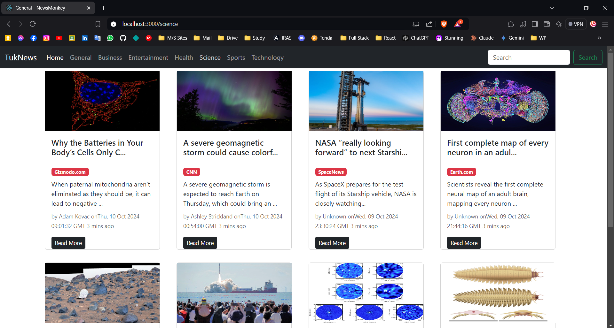

# Daily News App

Welcome to the The Daily Mukut - News App! This React application allows users to stay updated with the latest news from various categories including General, Sports, Science, Health, and Entertainment. It fetches news articles from the News API and provides a user-friendly interface for browsing the headlines.

## Features

- **Daily News Updates**: Get the latest news articles.
- **Category Selection**: Browse news by categories such as General, Sports, Science, Health, and Entertainment.
- **Infinite Scroll**: Load more articles seamlessly as you scroll down.
- **Responsive Design**: Optimized for both desktop and mobile viewing.

## Technologies Used

- **React**: A JavaScript library for building user interfaces.
- **News API**: A simple HTTP REST API for news.
- **CSS**: For styling the application.
- **React Infinite Scroll Component**: For infinite scrolling functionality.

